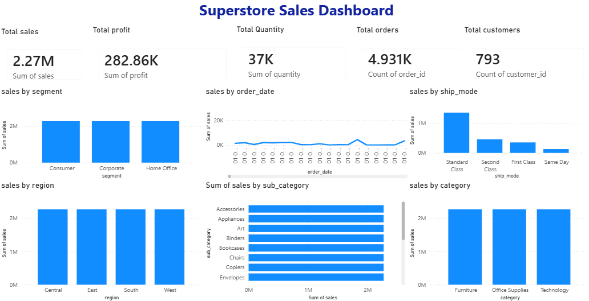

## Superstore Sales Dashboard

Power BI dashboard analyzing Superstore retail sales data — built on a normalized SQL data model with customer, product, and order tables, featuring interactive KPI cards and visual breakdowns of sales performance.

## Data Analysis Workflow
The project follows a SQL-to-Power BI workflow. The raw Superstore dataset was imported into MySQL as a single flat table, then normalized into three relational tables — `customers`, `products`, and `orders` — using SQL. These tables were imported into Power BI, where relationships were built natively in Model view (rather than flattening the data)

## Key SQL Analysis
- Split a flat 9,800+ row dataset into three normalized tables (customers, products, orders)
- Used `CREATE TABLE ... AS SELECT DISTINCT` to remove duplicate customer and product records
- Defined clean, renamed column aliases for readability
- Structured data to support relational modeling in Power BI (customer_id, product_id as keys)

## Key Metrics
- Total Sales: $2.27M
- Total Profit: $282.86K
- Total Orders: 4,931
- Total Customers: 793
- Total Quantity Sold: 37K

## Dashboard Features
- Sales trend over time (by order date)
- Sales breakdown by customer segment (Consumer, Corporate, Home Office)
- Sales breakdown by region
- Sales by category and sub-category
- Order distribution by ship mode

## Skills Used
- SQL (MySQL): Data normalization, DISTINCT, table creation, column aliasing
- Power BI: Data modeling and relationships (Model view)
- Data visualization & dashboard design
- Power BI theming, layout, and formatting

## Dashboard Preview

## Files
- `superstore_sales.sql` — SQL script for data normalization (customers, products, orders tables)
- `Superstore_sales_dashboard.pbix` — full interactive Power BI file
- `superstore_sales_dashboard.png` — dashboard screenshot
